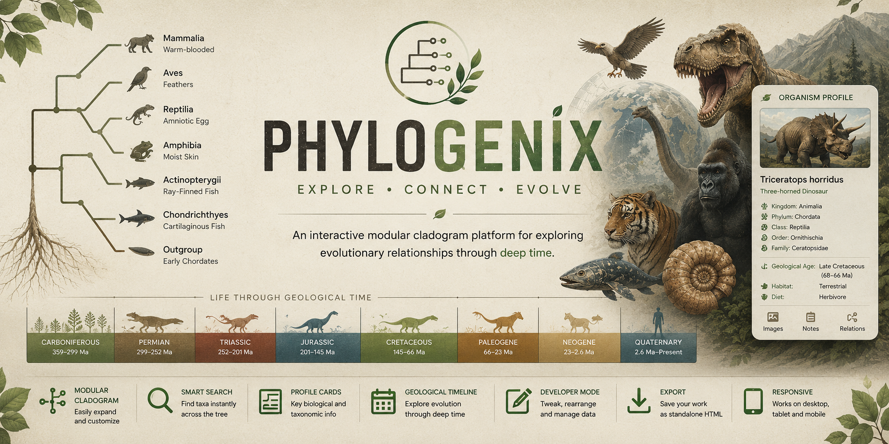

  

# 🌳 Phylogenix

### Evolutionary Cladogram Visualizer

Explore Evolution • Trace Lineages • Discover Connections

---

## 📖 Overview

**Phylogenix** is an open-source educational platform for exploring evolutionary relationships through interactive cladograms, geological timelines, and organism profiles.

---

## ✨ Features

- 🌳 Interactive cladogram
- 📅 Geological timeline
- 🧬 Organism profile cards
- 🔍 Smart search
- ↔️ Pan & zoom
- 💾 Export as standalone HTML
- 📱 Responsive interface

---

## 📜 License

 **GNU General Public License v3.0 (GPL-3.0)**.

---

## 👨‍🏫 Author

**Draven Ashcroft**

**M.Sc. Agricultural Entomology**  
**ASRB–NET Qualified**  
**DIPS Chain of Institutions, Tanda**

---

## 🙏 Acknowledgements

Developed with assistance from modern AI tools and cloud technologies.

Special thanks to:

- **OpenAI (ChatGPT)** — scientific review, debugging, and implementation
- **Anthropic Claude** — implementation assistance and optimization
- **Google Gemini** — concept exploration and refinement
- **Moonshot AI** — debugging and prototype refinement
- **DeepSeek** — early drafts and experimentation
- **Supabase** — backend infrastructure, image hosting, URL management, and cloud storage

---

## 🌳 Phylogenix

### *Tracing the Evolutionary Tree of Life.*

